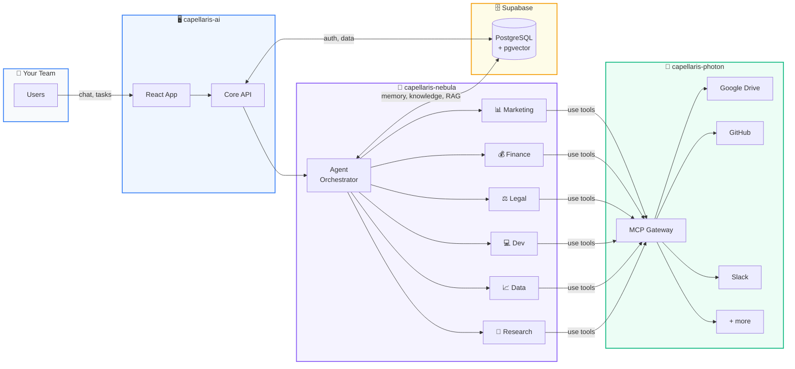

<!-- Header -->

<!-- Tagline badges -->

  
  
  
  

 

**Capellaris** is an AI-native agent console that lets organizations deploy, orchestrate, and observe 
autonomous AI agents — each with their own role, memory, knowledge base, and toolset.

 

<a href="https://capellaris.dscamargo.com.br">🌐 Live Demo</a> &nbsp;·&nbsp;
<a href="https://www.instagram.com/capellaris.ai">📸 Instagram</a> &nbsp;·&nbsp;
<a href="https://www.linkedin.com/in/daniel13">💼 LinkedIn</a>

  

---

## ⚡ How it works

 

## 🧠 What makes it different

<table>
<tr>
<td width="50%">

### 🤖 Hierarchical Multi-Agent System
Each org gets 9+ specialized agents (marketing, finance, legal, dev, HR, operations, data, research) orchestrated by a crew manager. Agents collaborate, delegate tasks, and use tools autonomously.

### 🔌 Model Context Protocol
First-class MCP gateway with per-org credential injection. Connect Google Drive, GitHub, Slack, Brave Search — agents use external tools without users ever seeing an API key.

</td>
<td width="50%">

### 📚 RAG Knowledge Base
Upload company docs, business plans, and product info. Vector search (pgvector + HNSW) injects relevant context into agent backstories automatically.

### 🏢 Multi-Org & Multi-Tenant
Full org lifecycle: create, invite (email/link), join, transfer ownership. RLS-enforced data isolation. Role-based access (owner/admin/member/viewer/guest).

</td>
</tr>
</table>

 

## 🛠 Tech Stack

### Frontend

  
  
  
  
  

### Backend

  
  
  
  
  

### Infrastructure

  
  
  
  
  
  

### AI & Models

  
  
  
  

### Dev & Ops

  
  
  
  
  

 

## 📦 Repositories

| Repo | Description | Stack |
|:-----|:------------|:------|
| **capellaris-ai** | Control Plane — console, API, auth, invites | React · Express · TypeScript |
| **capellaris-nebula** | Execution Plane — HMAS orchestration, RAG, learning | Python · FastAPI · CrewAI |
| **capellaris-photon** | MCP Gateway — tool proxy with per-org credentials | TypeScript · MCP Protocol |

 

## 👤 About the Creator

<table>
<tr>
<td>

**Daniel Camargo** — Full-stack engineer, polyglot, automation enthusiast.

Building Capellaris to make AI agents accessible to every team — not just developers.

  
  
  
  

</td>
</tr>
</table>

 

<!-- Footer -->

